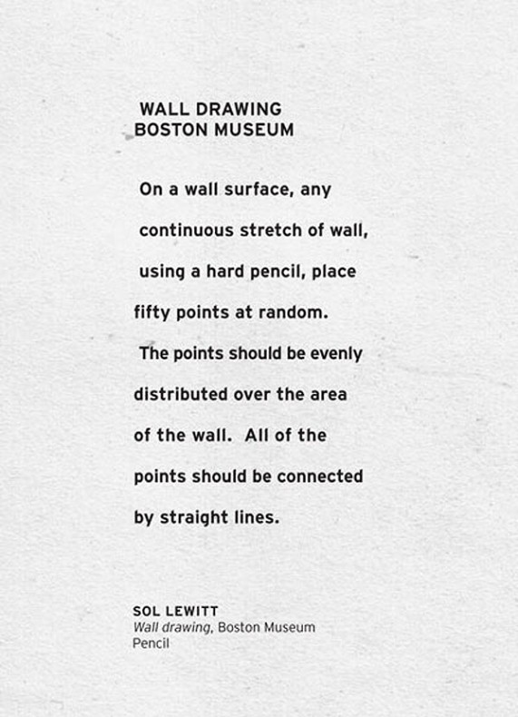
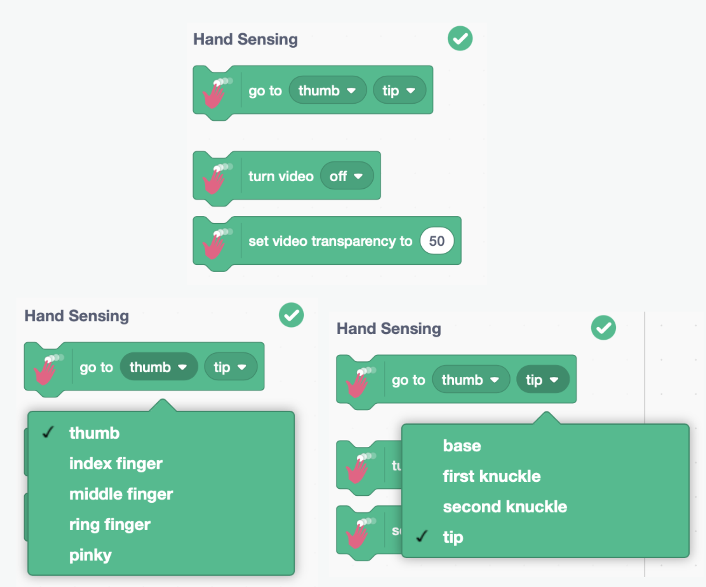
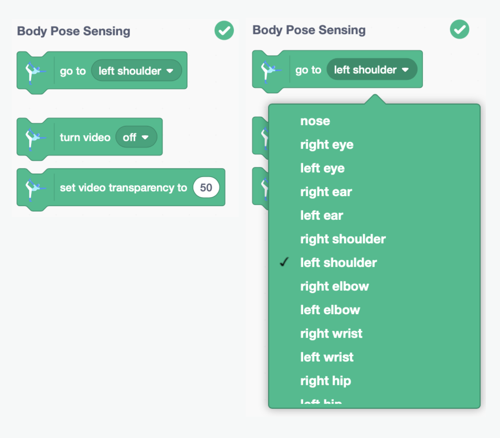
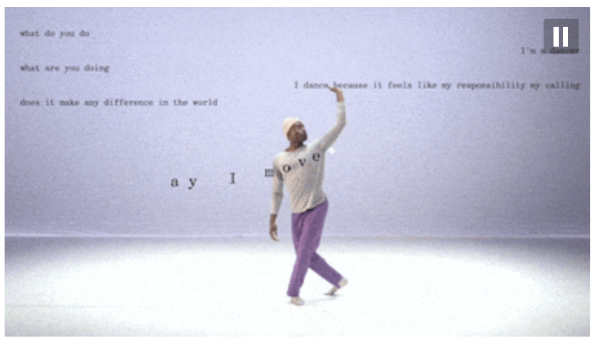
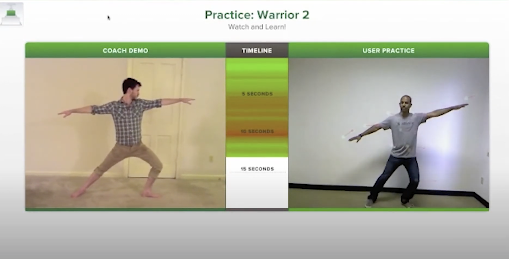
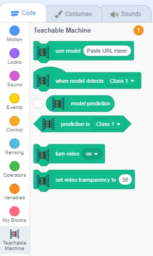

<!--
_class: lead
-->
# **인공지능을 활용한 창의 컴퓨팅**
인공지능과 컴퓨팅을 이해하고, 
자신의 아이디어를 코딩으로 구현하기

장윤재(janggoons@syu.ac.kr)
SW융합교육원, 삼육대학교

---
<!--
_class: lead
-->
# 00. Introduction

---
## 강사 소개
* 장윤재 [소개 웹페이지](https://sites.google.com/view/janggoons/home)
  - 대학에서 "컴퓨터교육학" 전공
  - "컴퓨팅"으로 이해하고 만들어 보는 것을 가르치고 배우기
  - 초보자를 위한 "컴퓨팅 교육"
  - 컴퓨팅을 가르치는 사람들을 가르치기

---
## 요즘 - 시대의 변화
* 4차 산업혁명, 지능정보사회, 디지털 사회...
* 소프트웨어, 인공지능, 데이터과학, 사물인터넷...
* 가장 유명한 (IT) 기업은? 
  - Facebook, Amazon, Apple, Netflix, Alphabet, Microsoft, Tesla, Nvidia ...
  - Coupang, Naver, Kakao, Nexon, VivaRepublica, Woowahan Brothers, ...
* 하루 동안 가장 많이 하는 활동은? 일어나서 가장 먼저 하는 일은?

---

## 어린 마음

"새로운 개념, 지식을 어린 아이처럼 순수하고 호기심 많은 태도로 배우거나 경험하려는 상태"

[지미와 베스의 사례](https://docs.google.com/document/d/1oDd5wswtiyNCjHQr5NgAv3ZU-8-5rJZUXEo3Puq_htI/edit#heading=h.fm06zi5merqn)

---
## 어린 마음

"과거의 지식과 습관을 모두 잊고 새롭게 시작하려는 상태"

[Unlearn](https://www.youtube.com/watch?v=MFzDaBzBlL0) 

---
## 목차
1. What is Coding?
    - Conditional Design, Coding & Computational
2. Body Interface
    - Start Dancing with AI, Teachable Machine
3. Creative Coding
    - Start p5.js & Snake Game
    - Image, Sound, Pose Classification
4. Media Art with AI
    - Design, Development, Share, Review

---
<!--
_class: lead
-->

## 01. Conditional Design

---

### 낙서 속 규칙
- 한 사람씩 돌아가며 두 점을 직선으로 연결합니다.
- 이 때, 직선은 서로 포개어지거나 다른 직선을 가로지를 수 없습니다. 
- 점을 연결한 선이 삼각형 모양을 이룰 때, 마지막으로 선을 그었던 사람이 자신의 심볼을 삼각형의 가운데에 그려 넣습니다.
- 삼각형의 모양은 어떠한 모양(이등변, 부등변)이어도 관계 없습니다. 
- 삼각형 안에는 점이 들어 갈 수 없습니다.

---
## 낙서 속 규칙

* 규칙을 정리해 봅시다.
  - 사전 준비
  - 각 참여자가 가장 처음으로 할 일
  - 각자가 돌아가며 반복적으로 할 일

---
## 낙서 속 규칙

* 사전준비
  1. 종이와 펜을 준비합니다.
  2. 2~3명의 사람이 한 팀이 됩니다.

* 각 참여자가 가장 처음으로 할 일
  1. 빈 종이에 무작위로 점을 고르게 찍어줍니다.
  2. 각자 자신이 원하는 심볼(원, 세모, 네모 등)을 정합니다.

---

## 낙서 속 규칙

* 각자가 돌아가며 진행할 일
  1. 선 그리기
    - 한 사람씩 돌아가며 두 점을 직선으로 연결합니다.
    - 직선은 서로 포개어지거나 다른 직선을 가로지를 수 없습니다.
  2. 삼각형 그리기
    - 점을 연결한 선이 삼각형 모양을 이루면, 자신의 심볼을 삼각형의 가운데에 표시합니다. 
    - 삼각형의 모양은 어떠한 모양(이등변, 부등변)이어도 관계 없습니다.
    - 삼각형 안에는 점이 들어 갈 수 없습니다.

---
<!--
_class: lead
-->

### 규칙성 경험하기

---

## [활동] 낙서놀이 1 (We were hatching)

* 사전 준비
  1. 큰 종이와 4가지 색의 펜(검정, 파랑, 빨강, 녹색)을 준비합니다.
  2. 4 명이 플레이 합니다.
  3. 참여자들은 각각 다른 색의 펜을 선택합니다.
  4. 가장 먼저 시작할 사람을 정합니다. 시계방향으로 돌아가며 진행합니다.

* 각 참여자가 맨 처음에 할 일
  1. 각자 종이 위에 임의의 위치에 점을 하나씩 찍습니다.
  2. 하지만, 점과 점사이의 간격은 5cm를 넘지 않도록 합니다.

---

## [활동] 낙서놀이 1 (We were hatching)

* 각자가 돌아가며 다음을 진행합니다.
  - 직선을 긋기
    1. 두 점을 잇는 직선을 그어주세요.
    2. 될 수 있으면 기존의 선에 연결되는 선을 그어주세요.
    3. 선을 그릴 때, 기존 선과의 각도를 다음과 같이 지켜봅시다.
      - 검정 : 0~45도, 파랑 : 45~90도, 빨강 : 90~135도, 초록 : 135~180도
    4. 도형이 완성되면 자신의 펜으로 마지막 선에 평행선을 그려서 도형을 채웁니다.
  - 점 하나를 추가로 찍기
    1. 기존 점에서 10cm 이내로 떨어진 점을 찍습니다. 
    2. 기존 점이 만드는 공간의 외부에 새 점을 찍습니다.

---
<!--
_header: ""
_footer: ""
-->

[we were hatching](https://www.conditionaldesign.org/workshops/hatching/)

---

## [활동] 낙서놀이 2 (We knotted)

* 사전 준비
  1. 큰 종이와 4가지 색의 펜을 준비합니다.
  2. 4명이 플레이 합니다.
  3. 참여자들은 각각 다른 색의 펜을 선택합니다.
  4. 가장 먼저 시작할 사람을 정합니다. 시계방향으로 돌아가며 진행합니다.

* 각 참여자가 맨 처음에 할 일
  1. 첫 번째 선은 종이의 가운데에 적당한 길이의 선을 그립니다.
  2. 두 번째 선 부터는 다른 색의 선을 한 번은 위로 한 번은 아래로 지나가도 록 그립니다.
  3. 위로 지나가는 선은 겹처서 그리고, 아래로 지나가는 선은 끊어서 그립니다.

---
## [활동] 낙서놀이 2 (We knotted)

* 각자가 돌아가며 다음을 진행합니다.
  - 선 그리기
    1. 자신의 선에서 한 쪽을 이어서 선을 그립니다. 선은 반드시 다른 색의 선 을 한번은 위로 한 번은 아래로 지나가야 합니다.
    2. 선의 한쪽을 이어서 그릴 때 더 이상 다른 색의 선을 위, 아래로 지나갈 수 없다면 그 쪽은 죽은 것입니다.
    3. 양 쪽 모두 더 이상 선을 이어서 그릴 수 없다면, 종이의 다른 공간에 새로 운 선을 그립니다.

---
<!--
_header: ""
_footer: ""
-->

[we knotted](https://www.conditionaldesign.org/workshops/knots/)

---
<!--
_header: ""
_footer: ""
-->

[SMFA Exhibitions | Sol LeWitt Drawing #118](https://www.youtube.com/watch?v=ky9K_-NJoPU)

---
## [회고] 낙서놀이

* 과정
  - 어떤 느낌이었나요? 재밌거나 어려운 점이 있었나요?
  - 무엇을 알게 되었나요? 어떤 점이 새로웠죠?
  - 솔 르윗의 벽드로잉과 낙서놀이를 비교하면 어떤 생각 이 드나요?

---
<!--
_class: lead
-->

### 규칙 만들기

---
## 조건부 디자인 Conditional Design

Conditional Design은 디자인 전략으로서 참가자 간의 협력을 자 극하고 예측할 수없는 결과를 가져 오는 장난스럽게 디자인 된 **일련의 규칙과 조건**들을 말합니다.

[Conditional Design
A manifesto for artists and designers.](https://conditionaldesign.org/manifesto/)

---
<!--
_header: ""
_footer: ""
-->

[we folded paper](https://conditionaldesign.org/workshops/fluxfold/)

---
<!--
_header: ""
_footer: ""
-->

[we encircled circles](https://conditionaldesign.org/workshops/encircling/)

---
<!--
_header: ""
_footer: ""
-->

[we intersected cells](https://conditionaldesign.org/workshops/cellular-relationships/)

---
## 규칙의 형식

* **준비** 사항과 초기 설정
* **반복** 할 기본적인 규칙과 설명 
* **예외 및 변칙**에 대한 처리

---
## [활동] 규칙 만들기

* 이번에는 여러분이 만들어 봅시다.
* 3명씩(혹은 4명) 짝을 지어주세요.
* 연습장에 연습하고 만들어진 규칙은 A5에 크고 또렷하게 적어주세요. 
* 규칙의 이름을 멋지게 지어주세요.
* 참여한 사람들의 이름도 적어주세요.

---
## [활동] 다른 팀이 만든 규칙 경험해보기

* 규칙을 서로 바꾸어 해봅시다.
* 만약 문제가 발생했다면 어떤 점이 문제였는지 적어두었다가
그 규칙을 만든 팀에게 전달합니다
* 우리의 목표는 최대한 규칙 범위 안에서 예쁜 작품을 만드는 것!

---
## [회고] 규칙 만들기

* 과정
  - 어떤 느낌이었나요? 재밌거나 어려운 점이 있었나요?
  - 무엇을 알게 되었나요? 어떤 점이 새로웠죠?
  - Conditional Design은 그동안 여러분이 경험한 창작 작업과 비교해보면 어떤 차이가 있나요?

---
<!--
_class: lead
-->

## 02. Coding & Computational

---
<!--
_header: ""
_footer: ""
-->

[SMFA Exhibitions | Sol LeWitt Drawing #118](https://www.youtube.com/watch?v=ky9K_-NJoPU)

----
<!--
_header: ""
_footer: ""
-->

<!--
https://www.richardlapham.com/itp/2017/11/14/sol-lewitt-generator
-->

벽 드로잉 
보스톤 미술관

어떤 쭉 펼쳐진 벽 표면 위에, 연필을 사용해서, 50개의 임의의 점을 찍습니다.
점들은 벽 표면에 골고루 분포되어야 합니다.
모든 점들은 직선으로 서로 연결되어야 합니다.

솔 르윗
벽 드로잉, 보스톤 미술관 연필

---
### Code 에 대해 생각하기
<!--
_class: lead
-->

---
## 코드: Code

* Communication: 소통, 대화
* Clarification: 설명, 해명
* Obfuscation: 혼란시키는 일

---
## 코드: [Code](https://www.merriam-webster.com/dictionary/code)

1. a systematic statement of a body of law
2. a system of symbols (such as letters or numbers) used to represent assigned and often secret meanings
3. instructions for a computer (as within a piece of software)

---
## 형식 언어/시스템: Formal Language/System

* 구조, 범위 따위가 명확하게 규정되고 정의된 인공 언어
* 주로 어휘, 논리, 프로그래밍에서 어법을 형식화하여 기술한 것

---
<!--
_header: ""
_footer: ""
-->

<!--
http://www.panbrick.ca/images/GenIns.gif
-->

---
<!--
_header: ""
_footer: ""
-->

---
<!--
_header: ""
_footer: ""
-->

<!--
labanotation
https://www.nytimes.com/2007/08/30/arts/dance/30nota.html
-->

---
<!--
_header: ""
_footer: ""
-->

<!--
knit visualizer
https://knitfoundry.com/knitvisualizer.html
-->

---
<!--
_header: ""
_footer: ""
-->

<!--
Correction signs in writing
https://nybookeditors.com/2013/06/copyediting-marks/
-->

---
## 코드는... 

* 컴퓨터에게 내 생각이나 의도를 전달하기 위한 소통의 도구
* 우리가 사용하는 자연어와 비슷한 점과 다른 점이 있다. 
* 코드는 대표적인 '형식언어' 이다.
* 코드는 어떤 점은 편하게 느껴지고, 어떤 점은 불편하게 느껴진다.
* 하지만, 결코 한 가지 방식만 있다고 생각하지 말자!
* 코드를 배우는 것은, "새로운 관점의 생각하고 표현하는 법"을 배우는 것이다.

---
<!--
_class: lead
-->

By relieving the brain of all unnecessary work,
a good **notation** sets it free to concentrate on more advanced problems

A. Whitehead, An Introduction to Mathematics

---
## Computational 의 의미

수작업 <-> 알고리즘 / 자동화
컴퓨터를 활용한 <-> 컴퓨테이션에 의한
결과를 정확히 예측한 <-> 결과를 정확히 예측할 수 없는
결과물을 정의한 <-> 과정을 정의한

---
<!--
_header: ""
_footer: ""
-->

[John Maeda | Design in Tech Report](https://designintech.report/)

---
<!--
_header: ""
_footer: ""
-->

["At Carnegie Mellon, computational thinking is everywhere"](https://www.cs.cmu.edu/link/research-notebook-computational-thinking-what-and-why)

---
<!--
_class: lead
-->

“If you want to survive in Design, 
you better learn to Code”

John Maeda

---
<!--
_class: lead
-->
## 03. Start Dancing with AI

---

## https://dancingwithai.media.mit.edu

---

## Dancing with AI
* OPEN POSEBLOCKS! > Extension
* Hand Sensing
* Face Sensing
* Body Sensing

---

---

---

---
<!--
_class: lead
-->

## [Body Sign](https://drive.google.com/file/d/14K7_aU1lk6xwMu3KoEjQpIuSL_LftgVk/view?resourcekey)

---
## 간단한 프로젝트 - body sign
* 스타터 코드 다운로드 [링크](https://bit.ly/Doomchit-Codes)
* Dancing with AI 에서 프로젝트 가져오기
* 동작시켜보기
* 나만의 body sign 만들기 > 화면 녹화하기
* 변형하기 

---
## Dancing with AI
* 공식 스크래치 버전이 아닙니다.
* 기존 스크래치 계정으로 로그인하거나 저장할 수 없어요.
* 파일 > 컴퓨터에 저장하기로 저장해 주세요. 
* 프로젝트가 복잡해지기 시작하면, 예상하지 못하게 멈출 수 있어요. 
* 다음 기능을 추가하거나 테스트 하기 전에 파일로 저장해 놓으세요.

---
<!--
_class: lead
_paginate: false
-->
## 좀 더 움직여보기 

---
## 신체를 자유롭게 더 움직여보기
* 예제 중 1개를 선택하여 동작 과정을 변경해 봅시다. 
* 기존 예제에서 사용한 것 말고 다른 센싱을 사용해 보세요.
  - 몸 / 손 / 얼굴
  - 근사한 작품을 만들지 않아도 되요.
  - 자신의 몸을 최대한 재미있게 사용해 봅시다.
  - 새로운 예제로 만들어도 좋습니다.

---
## 공유하기
* 네비게이터는 다른 팀의 시도를 살펴보고, 체험해 봅시다. 
* 돌아와서, 우리의 시도를 더 다양하게 만들어 봅시다.

---
<!--
_class: lead
_paginate: false
-->
## 인터랙티브 바디 인터페이스

---
<!--
_class: lead
_paginate: false
-->

### https://www.scroobly.com/

---
<!--
_class: lead
_paginate: false
-->

### https://www.billtjonesai.com/

---
<!--
_class: lead
_paginate: false
-->

### [The creative interface: connecting art and computer science | Cole Wiley | TEDxLSU](https://youtu.be/4yldLauJOZ4?t=619)

---
<!--
_class: lead
-->
## 04. Teachable Machine

---
## 데이터 수집
* 이미지 데이터를 수집하는 방법은,
  - 웹캠을 이용하여 사물을 직접 촬영하거나,
  - 이미지 파일을 수집한다.
* 이미지 파일 수집
  - 미리 수집된 저장소 활용
  - 직접 수집(스크래핑) -> [파이썬으로 구글 이미지 스크래핑 하기](https://github.com/janggoons/ai-future-society/blob/main/202305-sanggye/src/scraping.py)

---

## [Teachable Machine](https://teachablemachine.withgoogle.com/)

---
## [Teachable Machine](https://teachablemachine.withgoogle.com/)
* 컴퓨터 학습시키기
  - 구분(class)할 이름 지정
  - 구분(class)별로 이미지 촬영(또는 업로드)
  - 모델 학습(Train Model) 클릭

--- 
## [Teachable Machine](https://teachablemachine.withgoogle.com/)
* 잘 학습했는지 확인하기
  - Preview > 각각의 이미지를 보여주고 잘 분류하는지 확인
  - 분류가 잘 안되면 이미지 데이터를 추가하고, 다시 학습시킨다.
* 언제 잘 인식하고, 언제 잘 인식하지 못하는가?
  - 웹캠으로 촬영 한다면 배경은?
  - 사물은 정지한 상태로 촬영해야 할까?
  - 몇 개의 데이터를 수집해야 할까?
  
---

## Dancing with AI 에 TM 사용하기

---

## Dancing with AI 에 TM 사용하기
* TM 에서 모델 학습 > 모델 업로드
* Dancing with AI 에서 업로드한 모델 URL 입력
* 모델의 class 를 기준으로 동작 코드 작성하기

---
<!--
_class: lead
_paginate: false
-->
## 기계와 함께 춤을

---
## 몸으로 움직이는 작품 만들기
* 간단한 작품을 만들어 봅시다. 
* 그리고, 작품에 등장하는 캐릭터의 움직임을 몸으로 제어해 봅시다.
* 기존 예제를 참고해도 좋습니다. 단, 자신의 몸을 최대한 재미있게 사용해 봅시다. 

---
## 공유하기
* 네비게이터는 다른 팀의 시도를 살펴보고, 체험해 봅시다. 
* 돌아와서, 우리의 시도를 더 다양하게 만들어 봅시다.

---
<!--
_class: lead
-->
## 05. Start p5.js & Snake Game

---
<!--
_class: lead
-->

## 06. Image Classification

---
<!--
_class: lead
-->

## 07. Sound Classification

---
<!--
_class: lead
-->

## 08. Pose Classification

---
<!--
_class: lead
-->

## 09. Design & Development

---
<!--
_class: lead
-->

## 10. Share & Review

